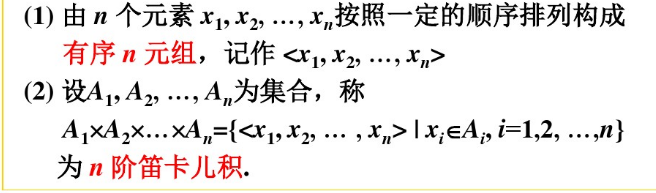
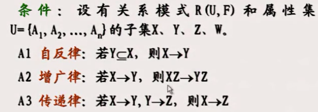
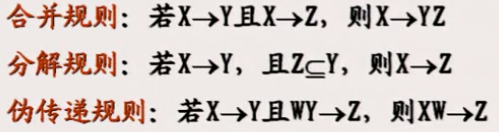

# 关系数据库

Rational database

## 关系

笛卡尔积:n阶笛卡尔积实际上是定义了一个n元元组的集合。

关系：n阶笛卡尔积的一个子集，称为集合D1，D2，... ，Dn上的一个n阶关系，记R（D1，D2, ... ，Dn）。用子集定义关系的原因是笛卡尔积往往不能表示实际的语义，而关系具有某种具体的语义。

关系的性质：

* 关系不满足交换律，R(D1,D2)与R(D2,D1)是不同的关系，也就是关系中的**元组分量**是有序的。

* 关系可以是有限集合，也可以是无限集合

* 元组的分量还可以是2阶以上的元组。

## 关系数据模型

### 关系的数据结构

这里对关系的性质进行修改，从而让关系模型的数据结构可以用一个规范化的二维表来表示。

* 关系是有限集合；元组是无序的；元组分量不能是2阶以上的元组，只能是单个的元素

** 注意区分下面关系的基本概念 与 实体的基本概念是两个体系，但是实体是可以用关系的概念表示的**

属性：Di的名字，不同的集合，名字不能相同

阈：属性的取值范围

候选码，候选键：关系中能够唯一标识一个元组的，包含最少属性的属性组。候选码如果包含了所有的属性，称为全码。候选码不唯一。候选码有相应的求解方法:将属性分类，其中N类和L类属性开始推导得到候选码；还可以通过候选键依赖图判定候选码。

主属性：候选码中的各个属性，不包含在**任何候选码**中的属性称为非主属性或非码属性。

主码：当前使用的候选码（从候选码们中，选出一个），属性加下划线表示主码。

外码：关系R的某个属性组是其他关系的主码，则该属性组称为关系R的外码。

### 关系操作

包括查询和更新操作，而更新操作包括插入，删除，修改。

关系代数采用关系运算描述查询内容。

关系演算使用谓词运算描述查询内容。

SQL（structural query language）结构化查询语言，是**关系数据库**的标准语言。具有查询，数据定义、更新、控制功能。

&emsp;关系操作采用集合操作，操作对象和操作结果都是集合，叫一次一集合；而非关系数据模型的操作方式为一次一记录。

### 关系完整性

实体完整性,entity integrity：关系的主属性，在所有元组对应的值都不能取空值。原因就是实体要可区分.

参照完整性,referential integrity:关系R的外码F，对应位关系S的主码，则R中F的值要么为空，要么等于S中的某个元组的主码。R称为参照关系，S称为被参照关系（目标关系）。

用户定义完整性，user-defined integrity：用户定义的约束。

实体完整性和参照完整性是关系模型必须满足的，称为关系的两个不变性。

关系模型进行完整性的检测和定义，应用程序不应承担这部分工作。

## 关系代数
关系运算（对关系的运算）包括传统的集合运算，以及专门的关系运算。

关系运算的作用是作为一种查询语言，实现对数据的查询。

### 传统的集合运算
并，差，交和笛卡尔积四种运算。运算对象为n阶关系R和S，其对应的属性曲子相同的域。

* 并union：将二者的元组并。

* 差except：有先后顺序，R-S表示去除R中的S元组。

* 交intersection：即属于R，又属于S的元组。

笛卡尔积cartesian product：对于n阶关系R和m阶关系S，将S元组分别拼接在每一个R元组的后面，最后元组数量为二者元组数量的乘积。

### 专门的关系运算
选择，投影，连接，除运算

* 选择selecting，限制运算：选择出使表达式为真的关系R中的元组。符号$\sigma_{Sno = ‘1’}$表示选择学号为 1 的。
 
* 投影projection：从关系中选出一些属性列组成新关系，其中列可以用数字表示。符号为$ {\pi _{Sno}}$表示对学号投影。

* 连接join：关系R和S，其中A，B分别是R，S的属性组，他们阶数相同，并可以进行比较（即可以使用=,<,>,<=,>=,!=）运算。连接运算是从R，S的笛卡尔积中选出满足A，B比较运算结果的元组。

等值连接：比较运算符取等号。其余的为非等值连接。

自然连接：A与B要是相同属性（与上面的A，B可比较即可，不要求相同相区别），且是等值连接，然后去掉的属性列（连接后A，B都在，去除一个）。符号为$R \infty S$

外连接：在自然连接中，对于连接所用的属性，在R和S中，都可能存在对方没有的属性值，如果将这些添加到自然连接后面，对于R中没有的S中的属性填充NULL，反之对于S中没有的R中的属性填充NULL，则为外连接。

左外连接，右外连接：对于  R连接S 问题，如果在自然连接后，只保留R中的舍弃的元组，则为左外连接，反之为右外连接。

* 除运算division：R(X,Y)和S(Y,Z)有相同的属性组为Y，如果X的某一个值，所对应的元组中Y的值的集合，包含了所有S在Y投影的Y的值的集合，则R除S的结果就为这样的值的集合。符号为$\div$。

**上述运算综合起来，能够实现查询特定信息的效果。如何充分利用特性进行查询是重要内容。**

## 关系模式和范式理论
在关系数据库设计中，所有数据的逻辑结构和相互之间的联系都由关系模式来表达。   具体为：关系模式是对关系元组逻辑结构和特征的描述，描述内容为元组的属性，属性的阈值，属性与阈值之间的映像，属性之间的依赖关系。

关系是关系模式的实例。如课程 与语文，数学。

关系模式定义：是一个4元组，R(U,D,DOM,F)
R为关系名；U为属性集；D为属性集中属性的阈；DOM为属性到阈的映射；F为属性U上一组数据之间的依赖关系。

### 数据依赖
包括函数依赖，多值依赖和连接依赖。依赖可能导致不好的模式，从而引起数据库更新异常。要通过分级关系消除不合适的函数依赖。

函数依赖：对于关系模式R(U)，X,Y是U的子集，对于R的**任意**一个实例，即关系r，r中不可能存在两个元组在X上的属性值相等，而在Y上的属性值不等，则称X函数确定Y 或 Y函数依赖于X，记$X \to Y$。其中X称为决定因素，Y称为依赖因素。

注意：上面的“任意”表示的是对于关系模式R的所有关系都要满足该条件；我们只能根据语义确定函数依赖（即通过客观事实和我们的经验），如学生名字和年龄之间的关系，只有在无重名时才存在函数依赖。

非平凡、平凡 函数依赖：如果Y函数依赖于X，如果Y是X的子集称为平凡函数依赖，如果不是子集称为非平凡的函数依赖。

互相依赖：如果X与Y互相依赖，表示为$X \leftrightarrow Y$

完全、部分 函数依赖：X函数确定Y，但是X任何一个真子集都不函数确定Y，称Y对X完全函数依赖，表示为$\rightarrow^F$,否则称为部分函数依赖，表示为$\rightarrow^P$。

逻辑蕴含：设F是关系模式R的函数依赖集合，如果Y函数依赖X，可以通过F中的函数依赖推导出来，则称Y依赖于X是F的逻辑蕴含表示为F|=X->Y。

闭包：F逻辑蕴含的函数依赖组成的依赖集合，记为$F^+$。

阿莫斯特朗公理：用于从F中推导出F的闭包：。

属性的闭包：设X为R的一个属性集（属性），通过公理可以推导出的，被X决定的属性组成的集合，为X的闭包，记为$X^+$。如果X的闭包中包含Y，则Y依赖于X成立。而计算X的闭包有对应的算法，所以判断Y是否依赖于X，首先算出X的闭包，然后判断X的闭包中时候有Y。计算出所有属性的闭包，综合起来就得到了F的闭包。

最小函数依赖集F：F中的每一个函数依赖的右端都是单个属性（任何函数依赖集都可以转化为这样的，分解方法实现）；F中的任何一个函数依赖被去除后的$F^1$都不等价于F（判断方法逐个去除，看看是否等价）；F中的A依赖于X，如果F中添加A依赖于X的子集Z，得到的$F^1$不等价于F（依赖关系的左侧属性没有多余的）。

**判断上述性质的方法就是充分利用属性的闭包**

传递函数依赖：Y非平凡依赖X，且Y不函数确定X，Z非平凡依赖Y，则Z对X传递函数依赖。

函数依赖定义的候选码：K为关系模式R(U,F)中的一个或一组属性，如果U完全函数依赖K，则K为R的候选码。

多值依赖：设R(U)是属性集U上的一个关系模式。X，Y，Z是的U的子集,并且Z=U-X-Y，如果对R(U)的任一关系r，都有如下性质：如果r中存在2个元组s、t，使得： 
s[X]=t[X] 则r中必存在元组u，使得：
(1) s[X]=t[X]=u[X] 
(2) u[Y]=t[Y] 且 u[Z]=s[Z] 
(即交换s、t在Y上的值得到的2个元组必在r中) 则称关系模式R满足多值依赖X→→Y。
如果Z为空集，则称为平凡多值依赖。

解释：注意上面w的Y对应**t**的Y，而w的Z对应的**s**的Z，表示的实际含义为一个X对应多个Y值。比如一个桌子对应两把椅子。

### 范式理论
范式Normal Form,NF：是关系数据库中的关系必须满足的条件，可分为8种，第1~6范式，BCNF，DKNF。

他们的关系是6<DKNF<5<4<BCNF<3NF<2NF<1NF。

1NF：关系模式汇总，关系对应一张二维表，如果表中的每个分量都是不可分的数据项，则这个关系模式为第一范式。如联系人（姓名，电话）如果存在家庭电话和工作电话就不符合1NF，将电话拆解为家庭电话和工作电话即可满足。

1NF:另一种表述：关系模式R中，如果R的每一个属性的阈中的值都是不可再分的最小数据单位，则为1NF。

满足1NF的叫做规范化关系，否则称为非规范化关系。

2NF：在1NF下，每一个非主属性完全函数依赖于主码。不满足2NF，可能因此插入异常，删除异常，修改复杂的问题。因此如果非主属性部分依赖于主码，则在插入时，非主属性属性不依赖的那个主码分量为空时就不能插入。删除时，如果想删除非主属性不依赖的那个主码分量也不行，因为会导致删除不必要的信息。。。解决办法是将完全依赖的非主属性与主码单独为一个关系，将部分依赖的非主属性与主码的分量单独为一个满足2NF的关系。

3NF，非主属性即不部分依赖于主码，也不传递依赖于主码。否则会引起与不满足2NF中类似的问题。解决办法是拆分关系，如在传递依赖中，将主码和中间属性组，中间属性组和非主属性组拆为两个关系。

注意：有的定义3NF时，没有部分依赖的要求，是因为传递依赖定义的不同。

BCNF：设关系模式R(U,F)满足1NF，对于任意Y函数依赖X，Y不属于X，X必有主码，则满足BCNF。可以退出满足BCNF的关系模式的特点为：

* 所有非主属性对每一个主码都是完全函数依赖，如果不是非主属性完全依赖的主码分量中应该包含主码，出现矛盾。

* 所有主属性对每一个不包含它的主码也是完全函数依赖。

* 没有任何属性完全函数依赖于非主码（主码是一个整体）的任何一组属性。依赖于主码分量也算是依赖于非主码的一组属性。

BCNF消除了3NF可能存在的主属性对于主码的部分依赖和传递依赖。

**一个模式中的关系模式如果都属于BCNF，其在函数依赖范畴已经实现了彻底分离，即消除了插入和删除的异常**。

4NF:关系模式属于1NF，如果对于R中的每一个非平凡多值依赖Y依赖于X，且Y不属于X，X中都含有主码，则满足。

## 关系模式分解
为了解决不好的模式设计导致的操作异常和数据冗余，需要对关系模式进行分解。

分解的原则是：保证数据的等价（保持无损连接），保证语义的等价（保持函数依赖）。

分解前后的数据库，要判断是否等价。对于数据的等价有一定的算法和判断规则；语义的等价多从语义方面分析，也要一些判断方法。

## 关系模型的规范化设计过程

关系模式的规范化：通过模式分解使满足低一级范式的关系模式转换为满足高一级范式的关系模式。

规范化使关系模型达到最小冗余和最少的操作异常。

过程：

* 确定个关系模式的函数依赖及和候选键

* 求各个关系模式的最小函数依赖集

* 合并左部决定因素相同的函数依赖

* 判断关系模式是否满足某个特定的范式。

* 如果不满足采用规范化算法转换为至少3NF。

**模式设计的原则是在保证无损连接和保持FD的前提下，设计成3NF的模式集。**
