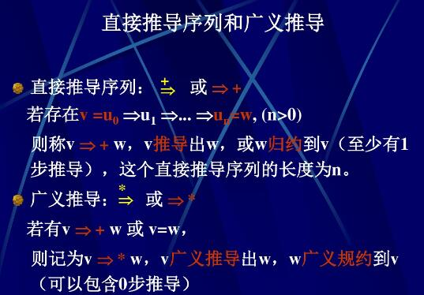
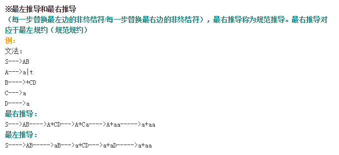

# 编译原理

## 第一章 编译概述

**编译**：将高级语言编转化为目标程序，目标程序可以是汇编程序或机器语言。

**汇编**：将汇编程序转换为机器语言

**解释器**：直接执行程序的翻译器。输入程序即能返回结果。

**编译过程**

&emsp;编译过程并不一定是按照下面顺序执行的，一遍扫描和多遍扫描编译程序采用不同的顺序。

分析阶段：

&emsp;进行词法分析（也称扫描，是线性分析，识别出记号，记号是具有独立意义的字符串，该字符串叫做该记号token的单词lexeme，将需要存放的单词放入符号表），工作依据是构词规则（词法）。注意记号对应的是内部表示，不同于字符串。词法分析不能识别标识符的类型，要到词义分析时才能识别类型，填入符号表。

&emsp;进行语法分析（是层次结构分析，把记号按层次分组，形成短语）工作依据是语法规则。利用递归方法定义了表达式和语句。分析树用于描绘赋值语句的语法结构，语法结构的更常见的内部表示是语法树。语法树中根节点是运算符，子节点是运算对象。

&emsp;进行语义分析（对语句的含义进行分析，保证程序各部分能够有机地结合在一起，如进行类型检查，必要时进行类型转换（可能插入一个转换函数，也可能直接替换为转换后的数）。为未生成目标代码收集如类型，目标地址等必要信息）依据语义规则。

分析阶段将源程序变换成便于下一个步骤处理的内部表示形式。

综合阶段：

&emsp;中间代码生成：中间代码应该易于产生和易于翻译成目标代码，如三地址代码即三地址指令序列。

&emsp;代码有阿虎首先基于中间代码进行，致力于减少代码占用空间，提高运行速度。

&emsp;目标代码生成：为每个变量指定存储单元，并将每条中间代码翻译成汇编语句或机器指令。

**编译器前端**：由与源程序无关而与目标机器无关的部分组成，通常包括词法分析，语法分析，语义分析和中间代码生成，符号表建立以及机器无关的代码优化，以及相应的错误处理工作和符号表操作。

**编译器后端**：由编译程序中与目标机器有关的部分组成，包括目标代码生成，与机器有关的代码优化，以及相应的错误处理工作和符号表操作。

**预处理器**:宏处理（允许用户在源程序中定义宏）；文件包含（如头文件）；语言扩充（扩充语言不支持的控制结构和数据结构，如while，ifelse）

**汇编程序**：汇编程序有一个汇编符号表，不同于编译阶段的符号表。

**连接程序**：也称连接装配程序，装入和连接程序，装配程序。完成两个工作。

&emsp;连接：把几个可重定位的机器代码文件连接成一个可执行程序。

&emsp;装入：读入可重定位的机器代码，修改需要重定位的地址，把修改后的指令和数据放在内存中适当的地方或形成可执行文件。

&emsp;可重定位的代码文件应该保留自己的符号宝，在连接时，当不同文件间互相引用变量或函数时，可以得到对应的地址。

## 形式语言与自动机基础

程序设计语言是形式化的语言。

### 字母表和符号串

字母表是符号的非空有限集合。

符号串的前（后）缀：从符号串的末尾（开头）删除零个或多个符号后得到的符号串。

真前缀，真后缀，真子串：除了自身的前缀，后缀，子串。

符号串连接有先后顺序。

符号串的幂：n次幂是n个字符串连接。字串的零次幂是空串。

*注意子串和子序列的区别*

子串：指的是删除了字串前缀 和/或 后缀得到的符号串。

子序列：删除零个或多个符号（可以不连续）后得到的符号串。

### 语言

语言是在某一确定字母表上的符号串的集合。语言有并，连接，闭包等运算，通过这些运算可以规定出语言中符号串的格式，如由数字开头后面接若干个字母。

### 文法

文法是描述语言的语法结构 的 形式规则。（形式的意思就是一个格式，如走个形式。语法是语言的规则，而文法就是用来描述这种规则的）这里主要研究上下文无关文法，对应于上下文无关语言。

上下文无关文法：推导式的左侧只能是非终结符。而上下文有关文法左侧可以是终结符。正规文法是上下文无关文法的特例。

文法可以表示为一个四元组，有终结符号集合，非终结符号集合，开始符号，产生式集合。

终结符：表示已经明确知道其含义的字符，如关键字，数字，常量（终结的意思是不能继续推导）。

开始符号：表示推导开始的符号，是一个“复杂”符号，而不是一个不能推导的简单符号。

推导：对产生式左边符号串中的一个非终结符号进行替换，得到有右边的符号串。用$ \Rightarrow $表示。

最左推导，最右推导。

右线性文法中推导为$ A \Rightarrow aB$ 而左线性文法中的推导为$ A \Rightarrow Ba$.

句型：一系列有非终结字符和终结字符组成的式子就是句型，仅含有终结符号的句型就是文法的句子。文法产生的所有句子组成的集合就是文法定义的语言。最左（右）推导得到就是左（右）句型。

短语：如果在连续推导中，一个字符（该字符也可以是一个产生式）是由一个非终结字符在一对一推导出来的，则称终结字符是这个非终结字符的短语。如果终结字符是非终结字符一次推导出来的，则成为直接短语；如果直接推导是最左推导则称为最左直接短语或称为句柄。

分析树（推导树）：是推导的图形表示，是有序有向树。根节点是开始符号，叶节点是非终结符或终结符，中间节点对应于推导过程，由于不能表示推导的先后顺序，一颗分析树可能对应不同的推导过程。子树：如果子树的根节点是非终结字符A，则称为A-子树。在分析树中，最左边的一棵树的叶节点从左到右排列就是该句型的句柄。

二义性：如果一个文法的某个句子不止一颗分析树与之对应，则这个句子是二义性的。含有二义性句子的文法是二义性文法。

&emsp;消除二义性，可以对于规定模糊的规则进行细化，从而消除二义性，如IF语句的例子。

**如果两个文法产生的语言相通，则两个文法是等价的，这就存在将二义性文法转化为非二义性文法的问题。而并不是每种语言都一定存在一个无二义性的文法**

左递归：如果有非终结符号A，对某个文法符号串$\alpha$，存在推导$A\mathop  \Rightarrow \limits^ +  A\alpha $。如果$\alpha$为空字符，则称文法是有环路的。
\[A\mathop  \Rightarrow \limits^ +  A\alpha \]

存在一种算法可以消除文法中的左递归，但是要求文法无环路，无$\varepsilon $产生式。对于一些包含$\varepsilon $产生式的文法，要先进行转换使之成为无$\varepsilon $产生式的文法，再进行消除左递归的操作。

提取左公因子：对于一个产生式，如果右侧的多个式子存在公共的左因子，在不知道采用哪一个产生式时，为了分析方便可以先左因子提取出来，进行分析。然后再决定接下来分析哪一个。

### 有限自动机

有限自动机：系统可以处于**有限**个内部状态中的任何一个，系统当前状态概括了过去输入的有关信息，并在输入条件下状态会发生改变。

确定（非确定）的有限自动机：在当前状态下，输入一个符号，自动机状态是唯一的（可能有两个以上可选择的）后继状态。

状态转换图：结点表示状态，有方向的线表示状态变换，边上标记导致变换的符号。特点：有限个状态；一个初始状态；若干个终结状态（0到多个）；终结状态用双同心圆表示，其余用圆圈。

状态转换图所识别的语言：从开始状态起，依次记录到终结状态路径上的输入状态，形成的字符串。

#### 确定的有限自动机（DFA）

确定的有限自动机的定义：可以定义为一个字母表W，其中元素对应输入符号，大小为n。Q是一个有限状态的集合，大小为m。q0表示初始状态。F是Q的子集，表示终结状态。T表示一个从W\*Q->Q的映射。这样就将有限自动机定义为一个五元组。

状态装换表：以状态为行，以字母表中的元素为列，形成一个n\*m的矩阵。

字符串被有限状态机识别：如果一个符号串，与一条从初始状态到终结状态路径上的所有输入符号连接起来的字符串相同，称这个符号串能为有限自动机识别。

有限自动机识别的语言：有限自动机识别的字符串的全体。这样就使用有限自动机定义了一种语言。

#### 非确定的有限自动机（NFA）

确定的有限自动机的定义：可以定义为一个字母表W，其中元素对应输入符号，大小为n。Q是一个有限状态的集合，大小为m。q0表示初始状态。F是Q的子集，表示终结状态。T表示一个从W\*Q->(2^Q)的映射。这样就将有限自动机定义为一个五元组。(2^Q)表示的集合Q的所有的子集。

非确定有限自动机也有状态转换表，但是其中每个转换后的状态可能不止一个。有关 **识别** 的定义与确定的有限自动机类似。

**对于任何一个非确定的有限自动机都有一个与之等价的确定的有限自动机，他们识别的语言是相同的，有转换函数构造法和子集构造法**

具有$\varepsilon$转移的非确定的有限自动机：可以定义为一个字母表W，其中元素对应输入符号，大小为n。Q是一个有限状态的集合，大小为m。q0表示初始状态。F是Q的子集，表示终结状态。T表示一个从(W $\varepsilon$)\*Q->(2^Q)的映射。这样就将有限自动机定义为一个五元组。(2^Q)表示的集合Q的所有的子集。区别就在于可能在输入为空字符时进行状态变换，表现在状态转换图中就是存在空字符的边。

**对任何一个具有$\varepsilon$转移的非确定的自动机，都存在一个等价的不具有$\varepsilon$转移的非确定的自动机与之对应。**

#### DFA简化

在一个自动机中，有些状态可能是无用的，如没有到达终结字符的路径的状态，或者从初始状态无法到达的状态。存在一个最少状态的DFA，并可以证明它是唯一的。

首先是可区分的概念：如果从状态s开始，经过路径w后到达终结状态，而从状态t开始经过w后到达一个非终结状态，就说w区分状态s和t。空串区分任何终结状态和非终结状态。当两个状态转换到终结状态的w完全相同时，称为状态等价。

简化思想：就是将等价的状态分到相应的子集，从每个子集中选取一个代表，并整合相应的边。最后删除无用的状态，得到就是最少状态的DFA。

### 正规文法和有限自动机的等价性

正规文法是左线性文法和右线性文法的统称。称为正规是因为可以使用所谓的正规式表示。从左右线性文法的描述可以看出，他们的产生式是同一类型的，如果混杂的就不属于正规文法。正规文法所产生的语言是正规语言。

正规文法和有限自动机的等价性：每一个右线性文法或左线性文法，都存在一个等价的有限自动机，反之亦然。等价性指的是二者对应的语言相同。

### 正规表达式和有限自动机的等价性

正规表达式：一种类型的字符可以使用串和语言有关的运算表示，这种表示称为正规表达式（简称正规式）。如$letter(letter|digit)^*$表示字母起始的由字符和数字连接起来的字符串。正规表达式所表示的语言是正规集。

每个正规表达式都可以表示一种语言，其所表示的语言称为正规集。正规表达式存在三种运算 \*（左结合，表示0个或多个字符） ，连接，|，分别对应于语言的 \*，连接和并。其优先级依次降低。

等价性：任何一个正规表达式都存在一个有限自动机和它产生相同的语言，反之亦然。

### 正规表达式和正规文法的等价性

通过上面的分析，这是显然的。

同一个程序设计语言的单词符号，使用正规表达式表示更加清晰和简洁，使用正规文法表示易于识别。通常先用正规表达式描述单词符号的结构，然后将其转化为等价的正规文法。

正规定义式:用来定义正规表达式,其中$A \Rightarrow r$表示A是一个名称，r是其实际内容。这样就定义了一个正规表达式A，以后可以利用这个A定义其他的正规表达式。注意：这里的箭头表示的是定义，要和产生式中的箭头分开。

**符号**

闭包云算法\*表示0到多个符号；正闭包运算符+:表示1到多个符号；可选运算符？:是 $|\varepsilon$的等价表示；表示[]:[A-Z]表示大写字母。
