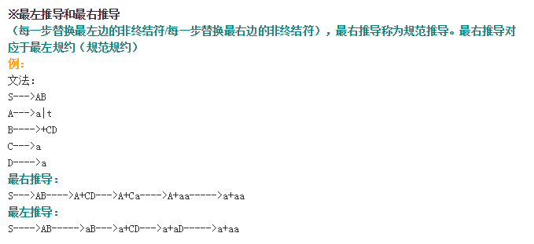

# 编译原理

## 第一章 编译概述

** 编译 **：将高级语言编转化为目标程序，目标程序可以是汇编程序或机器语言。

** 汇编 **：将汇编程序转换为机器语言

** 解释器 **：直接执行程序的翻译器。输入程序即能返回结果。

** 编译过程 **

&emsp;编译过程并不一定是按照下面顺序执行的，一遍扫描和多遍扫描编译程序采用不同的顺序。

分析阶段：

&emsp;进行词法分析（也称扫描，是线性分析，识别出记号，记号是具有独立意义的字符串，该字符串叫做该记号token的单词lexeme，将需要存放的单词放入符号表），工作依据是构词规则（词法）。注意记号对应的是内部表示，不同于字符串。词法分析不能识别标识符的类型，要到词义分析时才能识别类型，填入符号表。

&emsp;进行语法分析（是层次结构分析，把记号按层次分组，形成短语）工作依据是语法规则。利用递归方法定义了表达式和语句。分析树用于描绘赋值语句的语法结构，语法结构的更常见的内部表示是语法树。语法树中根节点是运算符，子节点是运算对象。

&emsp;进行语义分析（对语句的含义进行分析，保证程序各部分能够有机地结合在一起，如进行类型检查，必要时进行类型转换（可能插入一个转换函数，也可能直接替换为转换后的数）。为未生成目标代码收集如类型，目标地址等必要信息）依据语义规则。

分析阶段将源程序变换成便于下一个步骤处理的内部表示形式。

综合阶段：

&emsp;中间代码生成：中间代码应该易于产生和易于翻译成目标代码，如三地址代码即三地址指令序列。

&emsp;代码有阿虎首先基于中间代码进行，致力于减少代码占用空间，提高运行速度。

&emsp;目标代码生成：为每个变量指定存储单元，并将每条中间代码翻译成汇编语句或机器指令。

** 编译器前端 **：由与源程序无关而与目标机器无关的部分组成，通常包括词法分析，语法分析，语义分析和中间代码生成，符号表建立以及机器无关的代码优化，以及相应的错误处理工作和符号表操作。

** 编译器后端 **：由编译程序中与目标机器有关的部分组成，包括目标代码生成，与机器有关的代码优化，以及相应的错误处理工作和符号表操作。

** 预处理器 **:宏处理（允许用户在源程序中定义宏）；文件包含（如头文件）；语言扩充（扩充语言不支持的控制结构和数据结构，如while，ifelse）

** 汇编程序 **：汇编程序有一个汇编符号表，不同于编译阶段的符号表。

** 连接程序 **：也称连接装配程序，装入和连接程序，装配程序。完成两个工作。

&emsp;连接：把几个可重定位的机器代码文件连接成一个可执行程序。

&emsp;装入：读入可重定位的机器代码，修改需要重定位的地址，把修改后的指令和数据放在内存中适当的地方或形成可执行文件。

&emsp;可重定位的代码文件应该保留自己的符号宝，在连接时，当不同文件间互相引用变量或函数时，可以得到对应的地址。

## 形式语言与自动机基础

程序设计语言是形式化的语言。

### 字母表和符号串

字母表是符号的非空有限集合。

符号串的前（后）缀：从符号串的末尾（开头）删除零个或多个符号后得到的符号串。

真前缀，真后缀，真子串：除了自身的前缀，后缀，子串。

符号串连接有先后顺序。

符号串的幂：n次幂是n个字符串连接。字串的零次幂是空串。

*注意子串和子序列的区别*

子串：指的是删除了字串前缀 和/或 后缀得到的符号串。

子序列：删除零个或多个符号（可以不连续）后得到的符号串。

### 语言

语言是在某一确定字母表上的符号串的集合。语言有并，连接，闭包等运算，通过这些运算可以规定出语言中符号串的格式，如由数字开头后面接若干个字母。

### 文法

文法是描述语言的语法结构 的 形式规则。（形式的意思就是一个格式，如走个形式。语法是语言的规则，而文法就是用来描述这种规则的）这里主要研究上下文无关文法，对应于上下文无关语言。

文法可以表示为一个四元组，有终结符号集合，非终结符号集合，开始符号，产生式集合。

终结符：表示已经明确知道其含义的字符，如关键字，数字，常量（终结的意思是不能继续推导）。

开始符号：表示推导开始的符号，是一个“复杂”符号，而不是一个不能推导的简单符号。

推导：对产生式左边符号串中的一个非终结符号进行替换，得到有右边的符号串。最左推导，最右推导。用$ \Rightarrow $表示。如果初始符号和结果之间存在多个推导，则他们之间的关系可以用$\mathop  \Rightarrow \limits^{\rm{*}} $表示；如果结果字符为句子则上一个符号用$\mathop  \Rightarrow \limits^ +  $表示。

句型：一系列有非终结字符和终结字符组成的式子就是句型，仅含有终结符号的句型就是文法的句子。文法产生的所有句子组成的集合就是文法定义的语言。最左（右）推导得到就是左（右）句型。

短语：如果在连续推导中，一个字符（该字符也可以是一个产生式）是由一个非终结字符在一对一推导出来的，则称终结字符是这个非终结字符的短语。如果终结字符是非终结字符一次推导出来的，则成为直接短语；如果直接推导是最左推导则称为最左直接短语或称为句柄。

分析树（推导树）：是推导的图形表示，是有序有向树。根节点是开始符号，叶节点是非终结符或终结符，中间节点对应于推导过程，由于不能表示推导的先后顺序，一颗分析树可能对应不同的推导过程。子树：如果子树的根节点是非终结字符A，则称为A-子树。在分析树中，最左边的一棵树的叶节点从左到右排列就是该句型的句柄。

二义性：如果一个文法的某个句子不止一颗分析树与之对应，则这个句子是二义性的。含有二义性句子的文法是二义性文法。

** 如果两个文法产生的语言相通，则两个文法是等价的，这就存在将二义性文法转化为非二义性文法的问题。而并不是每种语言都一定存在一个无二义性的文法 **

&emsp;消除二义性，可以对于规定模糊的规则进行细化，从而消除二义性，如IF语句的例子。

